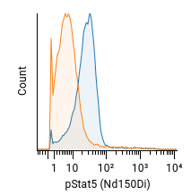

The function below subtracts two histograms to calculate an estimated "percent
positive." Four estimation methods are provided:

* `"channel-by-channel"` is as described in [Overton 1988](https://pubmed.ncbi.nlm.nih.gov/3061754/)
  and simply subtracts the two histograms, bin-by-bin, then sets negative
  differences to zero. (Histogram bins were historically called "channels" on
  old, analog cytometers.)

* `"Overton"` is as described in [Overton 1989](https://onlinelibrary.wiley.com/doi/epdf/10.1002/cyto.990100421)
  and is like "channel-by-channel," except negative values are subtracted from
  other bins instead of set to zero.

* `"ENS"` is the "enhanced normalized subtraction method" described in
  https://www.vsh.com/publication/JourneyThroughImmunofluorescenceAnalysis.pdf.
  In some places, this is also referred to as the "super-enhanced D value,"
  "SED" or "SEDymax," although there is another unpublished definition for
  "SED" that is different from "ENS." See also https://www.vsh.com/Publication/SuperEnhancedDValue.pdf.
  This method does not support `showPlot=TRUE`.

* `"KS"` is the Kolmogorov-Smirnov test D-value. Its value is the same as
  `"Overton"` but it does not support `showPlot=TRUE`.

Below is an example histogram and the percent positive calculated by each
method:

<div style="display: flex;">
  

  | Method | Estimate |
  | ------ | -------: |
  | ENS | 83.7%
  | channel-by-channel | 66.8%
  | Overton | 66.1%
  | KS | 66.2%

</div>

```R
#' Performs subtraction of two histograms to calculate percent positive.
#'
#' @param experimentId ID of experiment or a [`byName`] expression.
#' @param channel The channel name, like "PE-A" (not the reagent name like
#'   "CD3").
#' @param population The population ID or a [`byName`] expression.
#' @param file1 ID or `byName` expression of the file to subtract from (the test
#'   or sample file).
#' @param file2 ID of `byName` expression of the file to subtract (the control
#'   file).
#' @param method One of `"channel-by-channel"`, `"Overton"`, `"ENS"` or `"KS"`.
#' @param bins The number of histogram bins/channels. (Not applicable to `"KS"`
#'   method.)
#' @param showPlot If `TRUE`, displays a barplot of the subtracted histograms.
#'   (Not applicable to `"KS"` or `"ENS"` methods.)
#' @md
#' @examples
#' \dontrun{
#' library("cellengine")
#' authenticate() # prompts for username and password
#' subtractHistograms("5af60df8e1694f07a276a307", # experimentId
#'                    channel = "Nd150Di",
#'                    population = byName("CD33+"),
#'                    file1 = byName("LRS047_IL2GMCSF.fcs"),
#'                    file2 = byName("LRS047_unstim.fcs"),
#'                    method = "ENS")
#' # returns a scalar estimating the percent positive.
#' }
subtractHistograms <- function(experimentId,
                               channel,
                               population,
                               file1,
                               file2,
                               method="ENS",
                               bins=256,
                               showPlot=TRUE) {

  if (!(method %in% c("channel-by-channel", "Overton", "ENS", "KS")))
    stop("method must be one of 'channel-by-channel', 'Overton', 'ENS' or 'KS'.")

  experiment = getExperiment(experimentId)
  scaleSet = getScaleSets(experimentId)$scales[[1]]
  scale = scaleSet[scaleSet$channelName == channel, "scale"]
  if (nrow(scale) == 0)
    stop(paste0("Channel ", channel, " not found in experiment. Please check the spelling."))

  file1data = getEvents(experimentId,
                        file1,
                        population,
                        compensatedQ = TRUE,
                        compensation = experiment$activeCompensation,
                        headerQ = TRUE,
                        format="TSV")
  file2data = getEvents(experimentId,
                        file2,
                        population,
                        compensatedQ = TRUE,
                        compensation = experiment$activeCompensation,
                        headerQ = TRUE,
                        format="TSV")

  # TODO: in v1 of the CellEngine toolkit, remove make.names here.
  # sub() is used to remove the leading X from make.names("488") -> "X488"
  file1col = file1data[, grepl(sub("^X", "", make.names(channel)), colnames(file1data))]
  file2col = file2data[, grepl(sub("^X", "", make.names(channel)), colnames(file2data))]

  # Warning: if clamp_q = FALSE, then ultra-negative values can impact histograms.
  file1col = applyScale(scale, file1col, clamp_q = FALSE)
  file2col = applyScale(scale, file2col, clamp_q = FALSE)

  if (method == "KS") {
    ks = ks.test(file2col, file1col, alternative="greater")
    return(100 * ks$statistic)
  }

  # Precompute bins
  minVal = min(file1col, file2col)
  maxVal = max(file1col, file2col)
  breaks = seq(minVal, maxVal, length.out = bins + 1)

  # Bin data into histogram
  file1counts = tabulate(cut(file1col, breaks, labels=F, include.lowest=T), nbins=bins)
  file2counts = tabulate(cut(file2col, breaks, labels=F, include.lowest=T), nbins=bins)

  # Rescale the counts as if the same number of events are in both histograms.
  normFactor = length(file1col) / length(file2col)
  file2counts = file2counts * normFactor

  if (method == "channel-by-channel") {
    difference = file1counts - file2counts
    difference = pmax(difference, 0)
    if (showPlot)
      barplot(difference)
    return(100 * sum(difference) / length(file1col))

  } else if (method == "ENS") { # Super enhanced D-max
    # Cumulative sum, normalized to 1
    cum1 = cumsum(file1counts)
    cum1 = cum1 / cum1[length(cum1)]
    cum2 = cumsum(file2counts)
    cum2 = cum2 / cum2[length(cum2)]

    # Max positive difference
    xd = which.max(cum2 - cum1)
    Cx = cum2[xd]
    Tx = cum1[xd]
    Dx = Cx - Tx

    # In theory, Dx is equal to Overton's subtraction.
    # Dx / Cx is the "enhanced Dmax" (pos_ed, scenic view 4)

    # Keep the histogram portion from 1 to xd and renormalize so the sum is 1
    cum1d = cum1[1:xd]
    cum1d = cum1d / cum1d[length(cum1d)]
    cum2d = cum2[1:xd]
    cum2d = cum2d / cum2d[length(cum2d)]

    xd2 = which.max(cum2d - cum1d)

    pos_ens = (Cx - Tx) / Cx + (cum2[xd2] * Tx - Cx * cum1[xd2]) / (Cx * Cx)

    return(100 * pos_ens)

  } else { # Overton with corrections.
    # See Appendix A of Overton 1988 and Overton 1989
    low = 1
    for (chan in 1:bins) {
      diff = file1counts[chan] - file2counts[chan]
      file1counts[chan] = max(0, diff)
      while (diff < 0 && low < chan) { # On negative differences, cumulative subtract.
        while (file1counts[low] <= 0 && low < chan) {
          low = low + 1
        }
        if (low < chan) { # Cancel out positive differences in lower channels.
          diff = diff + file1counts[low]
          file1counts[low] = max(diff, 0)
        }
      }
    }
    if (showPlot)
      barplot(file1counts)
    return(100 * sum(file1counts) / length(file1col))
  }
}
```
